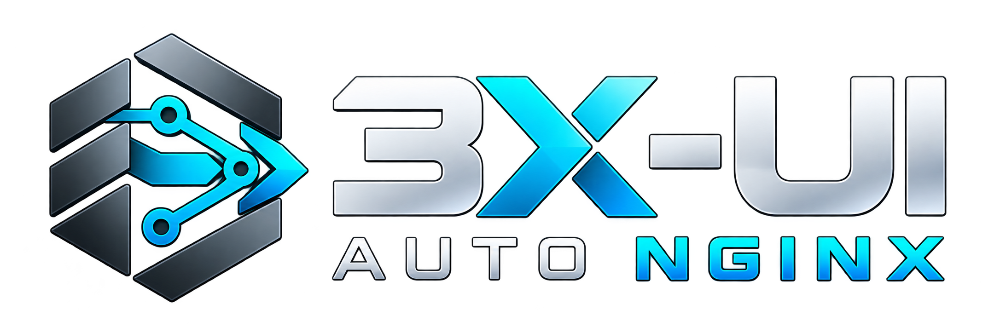

<div align="center">

[🇷🇺 Русский](README_RU.md) · [🇬🇧 English](README.md) · [🇪🇬 العربية](README_AR.md) · [🇮🇷 فارسی](README_FA.md) · 🇨🇳 **简体中文** · [🇪🇸 Español](README_ES.md) · [🇹🇷 Türkçe](README_TR.md)

<p align="center"></p>

### 在自己的 VPS 上自动部署 3X-UI / XRAY-CORE

**REALITY · XHTTP · HYSTERIA2 · WebSocket · gRPC · NGINX · HTTPS · BACKUP / RESTORE**

两个域名，一台全新的 VPS，只需几分钟即可完成安装。

[](https://github.com/xPROMSx/3x-ui-auto-nginx/actions/workflows/stack-xhttp.yml)
[](https://github.com/xPROMSx/3x-ui-auto-nginx/actions/workflows/stack-backup.yml)
[](#technical-details)
[](https://github.com/xPROMSx/3x-ui-auto-nginx/releases)

[发布版本](https://github.com/xPROMSx/3x-ui-auto-nginx/releases) · [Telegram Web Proxy Manager](#telemt-web-manager) · [问题反馈](https://github.com/xPROMSx/3x-ui-auto-nginx/issues)

</div>

**3X-UI AUTO NGINX** 自动安装 [3x-ui](https://github.com/MHSanaei/3x-ui) 和 Xray，并配置 nginx、HTTPS、连接配置、订阅、网络诊断以及 Backup / Restore。AmneziaWG 3.1 和支持 DoH 的 AdGuard Home 均为可选功能。

准备两个域名和一台全新的 VPS 即可。安装脚本会自动选择并部署一个伪装网站。

## ✨ 为什么选择这个项目？

| | |
| --- | --- |
| **预配置的连接方式**<br>REALITY、XHTTP、Hysteria2、WebSocket 和 Trojan gRPC 均已配置。 | **内部服务不直接暴露**<br>面板和订阅服务的内部端口不会直接暴露到互联网。 |
| **受限的 nginx 路由**<br>外部请求无法被代理到任意本地端口。 | **Backup / Restore v3**<br>回滚当前 VPS，或将备份恢复到新服务器，包括其他 VPS 服务商的服务器。 |
| **自动管理证书**<br>自动申请和续期 Let's Encrypt 证书，无需手动配置。 | **AdGuard Home + DoH**<br>按需启用，无需第三个域名。 |

<a id="installation"></a>

## 🚀 快速开始

配置**两个域名**的 DNS 记录，使它们指向你的 VPS IP 地址：一个用于面板，另一个用于 REALITY。通过 SSH 以 **root** 身份登录，并开放 TCP **80/443** 和 UDP **443**。查看[支持的系统](#technical-details)。

```bash
curl -fSL https://raw.githubusercontent.com/xPROMSx/3x-ui-auto-nginx/main/x-ui-latest.sh -o x-ui-latest.sh && bash x-ui-latest.sh
```

安装程序会询问两个域名，并提供 AmneziaWG 和 AdGuard Home 的可选安装。也可以直接通过参数指定域名：

```bash
bash x-ui-latest.sh -subdomain panel.example.com -reality_domain reality.example.com
```

> **⚠️ 仅用于全新安装或完全重装。** `x-ui-latest.sh` 会删除原有的 3x-ui 数据库和 nginx 配置。**不要用它来更新正在运行的 VPS。** 重装前请将备份保存到服务器之外。检测到现有安装时，重装或卸载必须输入大写的 `YES` 确认。

完成后会显示**面板地址、随机生成的登录凭据和诊断地址**（通过 3x-ui 认证的 MTR/LibreSpeed）。如安装 AdGuard Home，还会显示管理地址、密码和 DoH 地址。

## 🚀 连接配置

| 连接方式 | 状态 |
| --- | :---: |
| VLESS + REALITY | ✅ 可直接使用 |
| VLESS + XHTTP | ✅ 可直接使用 |
| Hysteria2 | ✅ 可直接使用 |
| VLESS + WebSocket | ✅ 可直接使用 |
| Trojan + gRPC | ✅ 可直接使用 |
| AmneziaWG 3.1 | ✅ 可选 |

五种主要连接方式均已预配置，可按需在 3x-ui 中启用，无须修改 nginx。只有在安装时选择了 AmneziaWG，才会添加该连接。**客户端需要在面板中创建**；实际兼容性取决于客户端应用及其版本。

### 订阅

标准订阅、JSON 以及 **Mihomo / Clash** 通过 nginx 和 HTTPS 提供。添加 `provider=1` 参数可返回供代理提供者使用的原始订阅，而非完整的 Clash 配置。

## 🧩 可选功能

这两项功能均可在安装时选择，默认关闭。

### AdGuard Home + DoH

出现 `Install AdGuard Home with DNS-over-HTTPS? [y/N]:` 提示时输入 `y`。无需第三个域名：管理界面位于面板域名下随机生成的 `/adg-.../` 路径，DoH 地址为 `https://panel.example.com/dns-query`。安装程序不会向公网开放 TCP/UDP **53** 端口。配置和数据均包含在 **Backup / Restore v3** 中。

---

### AmneziaWG 3.1

安装时可选择配置 **AmneziaWG 3.1（UDP/8443）**（默认关闭）。出现 `Install AmneziaWG on UDP port 8443? [y/N]:` 提示时输入 `y`。它内置于 3x-ui，使用面板域名。安装完成后，请在 3x-ui 面板中添加客户端并获取配置文件或 `vpn://` 链接；安装程序不会自动创建客户端。UFW 会自动放行 UDP/8443；**Backup / Restore v3** 会保留配置并恢复相应的防火墙规则。

## 💾 备份与恢复

**Backup / Restore v3** 可用于回滚 VPS 或在重装系统后恢复到兼容的服务器。工具会随安装脚本一同安装，使用 root 身份运行：

```bash
# 创建备份
x-ui-backup backup

# 列出备份
x-ui-backup list

# 恢复指定备份
x-ui-backup restore /var/backups/x-ui/<archive>.tar.gz
```

备份文件保存在 `/var/backups/x-ui/`。

> **备份包含敏感数据：** 客户端数据库、密码和证书私钥。请在 **VPS 之外** 保存副本，并且只恢复来源可信的备份文件。

[在新 VPS 上恢复](#technical-details)。

## 🔐 安全性

服务接口不会直接暴露到互联网。面板、订阅和附加服务均通过 nginx 和 HTTPS 访问，内部端口仅在本机监听。

项目不会将请求任意代理到 localhost 端口。遇到关键错误时，安装或恢复过程会停止，而不是启动不完整的配置。

<a id="technical-details"></a>

<details>
<summary>⚙️ 技术细节与兼容性</summary>

- **系统：** Ubuntu 24.04、Ubuntu 26.04 和 Debian 13。不支持 Debian 12。
- **UFW：** 添加 80/tcp、443/tcp 和 443/udp 规则。仅在识别并允许 SSH 端口后才会启用原本未启用的 UFW；否则保持未启用并给出警告。恢复操作不会启用 UFW。
- **证书：** 通过 Let's Encrypt webroot 和系统 `certbot.timer` 自动续期，无需停止 nginx。
- **3x-ui 版本：** 默认安装已针对 3X-UI AUTO NGINX 进行充分兼容性测试的最新版本，并不一定是 3x-ui 上游刚发布的最新版。安装完成后，你可以通过 3x-ui 自带的更新功能自行升级，但新版本与现有配置的兼容性可能尚未得到验证。也可以通过 `-version <tag>` 明确指定其他稳定版（最低支持 v3.8.0）；安装程序会提醒该版本尚未通过兼容性验证。

**在新 VPS 上恢复：** 操作系统、版本和 CPU 架构应与备份对应。若 IP 改变，请更新 DNS。**不要运行** `x-ui-latest.sh`；仅安装备份工具，然后恢复可信的归档文件：

```bash
curl -fSL https://raw.githubusercontent.com/xPROMSx/3x-ui-auto-nginx/main/assets/backup/x-ui-backup.sh -o /tmp/x-ui-backup
install -o root -g root -m 0755 /tmp/x-ui-backup /usr/local/bin/x-ui-backup
rm -f /tmp/x-ui-backup
x-ui-backup restore /root/<archive>.tar.gz
```

SSH、系统配置及基础防火墙仍由管理员负责。对于 v2 备份，请使用对应旧版本中的恢复工具。

</details>

<a id="telemt-web-manager"></a>

## ✈️ Telegram Web Proxy Manager

[配套项目](https://github.com/xPROMSx/telegram-web-proxy-manager)，用于搭建自己的 Telegram WEB Proxy，支持 HTTPS、伪装网站以及带回滚机制的更新。

两个项目相互独立；**此安装脚本不会安装 Telegram Web Proxy Manager**。

## 🤝 致谢与项目来源

本项目基于 [3x-ui-pro](https://github.com/mozaroc/3x-ui-pro) 开发，并独立维护。Fork 之后，对 nginx/SNI 路由和 XHTTP 配置进行了大幅重构，重新设计了 TLS 证书签发与自动续期流程，并引入支持恢复和回滚的 Backup / Restore v3。此外还增加了运行于 UDP/443 的 Hysteria2，并修复了已发现的安全问题。

面板本身来自 [MHSanaei/3x-ui](https://github.com/MHSanaei/3x-ui)。第三方组件的权利及其现有许可仍归原作者所有。

xPROMSx 贡献者原创的开发内容和修改部分以 [GNU GPL-3.0-only](LICENSE) 授权。Copyright (C) 2026 xPROMSx contributors. 此许可仅适用于贡献者有权授权的内容，不会自动为继承代码重新授权，也不意味着整个仓库均采用 GPL。许可范围及第三方组件声明详见 [THIRD_PARTY_NOTICES.md](THIRD_PARTY_NOTICES.md)。

<div align="center">

**两个域名，几分钟，搭建自己的 3x-ui / Xray 服务器。**

⭐ 如果这个安装脚本对你有帮助，欢迎在 [GitHub 上点个 Star](https://github.com/xPROMSx/3x-ui-auto-nginx)，让更多人发现它。

[安装](#installation) · [发布版本](https://github.com/xPROMSx/3x-ui-auto-nginx/releases) · [问题反馈](https://github.com/xPROMSx/3x-ui-auto-nginx/issues)

</div>
